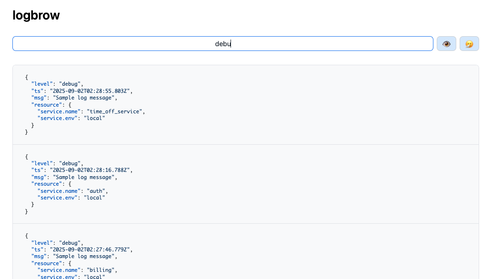

# logbrow



Utility to browse logs in your browser. Pipe logs into the server and view them live at http://localhost:3966.

## Usage

```sh
cat your.log | npm start
# or
some-app | npm start
```

Then open [http://localhost:3966](http://localhost:3966) in your browser.

## Development

- `npm install` to install dependencies
- `npm start` to run the server with ts-node

## Building & Installation (Standalone Binary)

You can build and install LogBrow as a standalone executable using [pkg](https://github.com/vercel/pkg) and the provided Makefile:

1. Install dependencies:
	```sh
	npm install
	```
2. Build the binaries:
	```sh
	make pkg
	```
	The Makefile will automatically install `pkg` globally if it is not already available in your PATH.
	The binaries will be in the `dist/` folder (e.g., `dist/logbrow-macos`).

## Project Structure

- `src/server.ts` - Main server entry point
- `src/controllers/logsController.ts` - Log storage and API
- `src/routes/logs.ts` - API route for logs
- `src/views/index.html` - Simple log viewer UI
